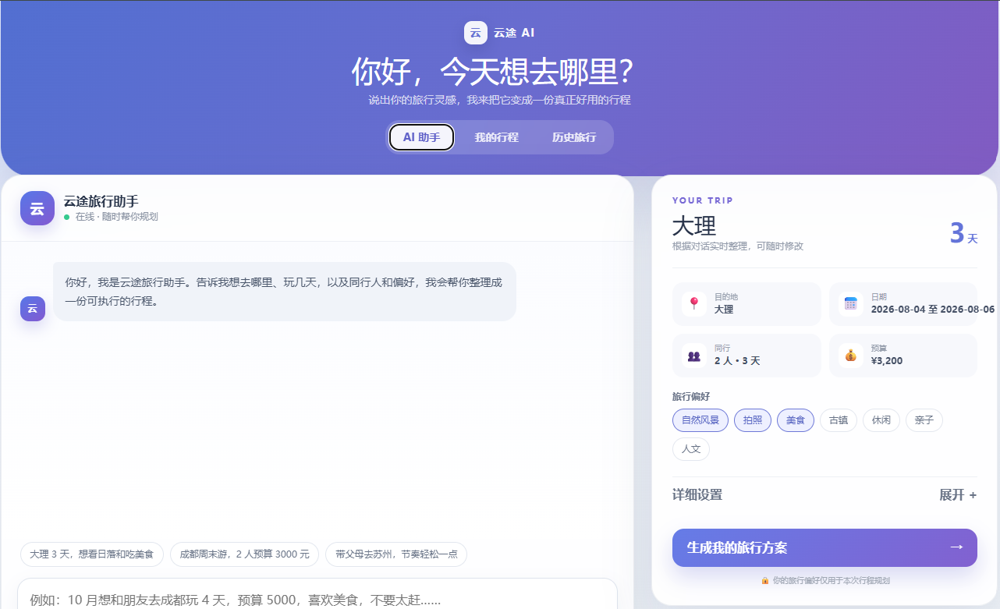
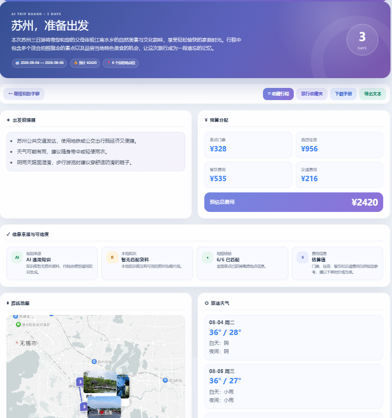
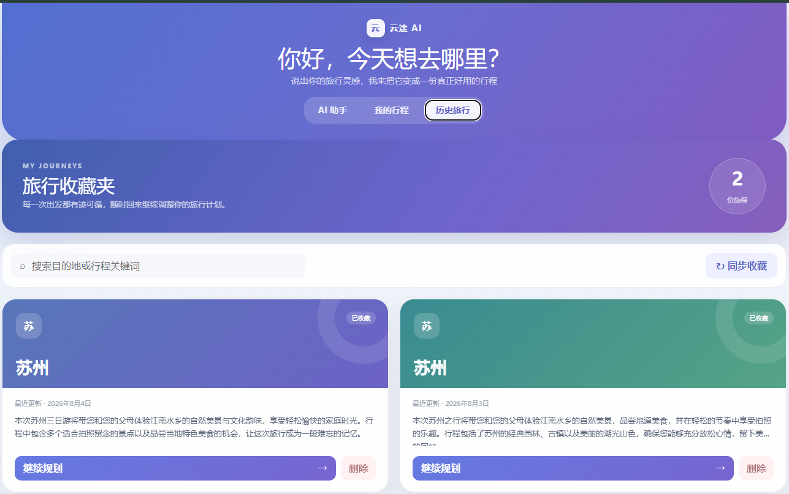
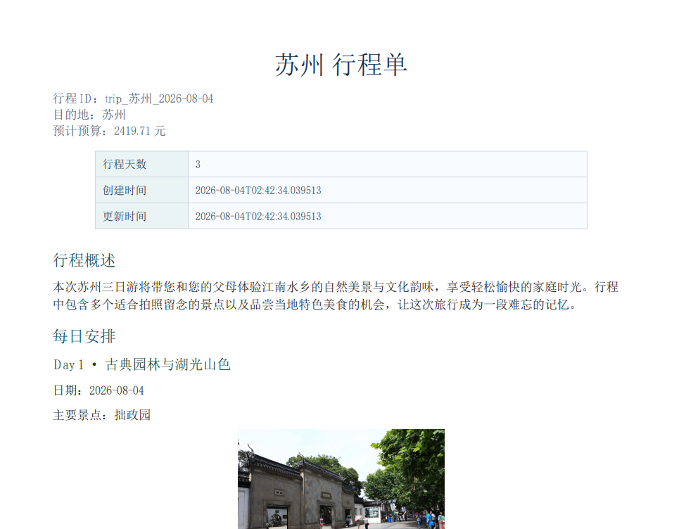
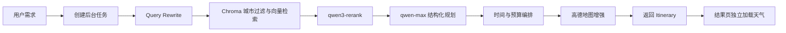

# 云途 AI

云途 AI 是一个面向中文旅行场景的本地 Web 应用。它把目的地、日期、预算、人数、节奏和个人偏好整理成结构化行程，并在结果页集中展示每日安排、预算、地图、天气、来源可信度和历史收藏。

它不是简单地让大模型输出一段旅游文案，而是把生成过程拆成一条可观察、可取消、可保存和可编辑的工作流：

```text
旅行需求
→ 本地攻略检索
→ LLM 结构化规划
→ 后端预算与时间编排
→ 高德地点信息补充
→ 结果页天气与可信度展示
```

> 当前版本定位为单机、单用户的完整产品原型，采用前后端本地启动方式，不包含容器部署方案。

## 页面预览

### AI 助手

对话区用于快速提取目的地、天数、人数、预算和偏好；右侧卡片可以继续精确调整日期、节奏、住宿标准和饮食要求。



### 行程结果

结果页展示逐日计划、预算拆分、景点地图、天气、旅行提醒和导出入口。当前页面还增加了“信息来源与可信度”区域，用于说明本地知识、模型知识和高德核验情况。



### 历史旅行

只有主动收藏的行程会写入 SQLite。历史页支持搜索、重新打开和删除。



### 旅行手册

已保存行程可以导出 Markdown 或中文 PDF。



## 当前能力

| 模块 | 当前实现 |
| --- | --- |
| 需求输入 | 对话式快速输入 + 结构化详细设置 |
| 行程生成 | qwen-max / OpenAI-compatible Chat API + LangChain 结构化输出 |
| 后台任务 | 创建任务、进度轮询、取消、失败重试、重复请求复用 |
| 本地知识 | Markdown/PDF 攻略、入库清洗、Chroma 向量检索、城市过滤、距离阈值 |
| 检索优化 | LLM Query Rewrite、text-embedding-v4、qwen3-rerank、最低相关分 |
| 无知识城市 | RAG 返回空上下文，规划模型使用自身通用知识继续生成 |
| 地图增强 | 高德 POI、地理编码、坐标、图片、路线距离与耗时 |
| 天气 | 结果页独立请求高德天气预报 |
| 铁路查询 | 可选 12306 MCP，查询去程/返程候选车次、余票和票价，不处理登录或购票 |
| 来源说明 | 显示规划来源、RAG 命中数、地图匹配数和费用估算声明 |
| 智能编辑 | 使用自然语言调整指定日期，失败时回退到规则编辑 |
| 历史记录 | SQLite 保存、列表、详情、删除 |
| 导出 | Markdown、中文 PDF |
| 缓存 | 可选 Redis，覆盖 RAG、Rerank、地图和天气 |
| 后端诊断 | Request ID 与 HTTP 结构化错误；请求、RAG、Planner、地图阶段耗时仅记录在日志中 |

## 前端交互

应用包含三个主视图：

- **AI 助手**：录入需求、查看生成进度、取消或重新生成。
- **我的行程**：查看当前行程、地图、天气、预算、来源可信度并进行编辑或导出。
- **历史旅行**：管理主动收藏到 SQLite 的行程。

对话框中的需求提取由前端规则完成，例如识别“苏州”“3 天”“2 人”“预算 3000”“轻松”等信息。真正的行程内容在点击“生成我的旅行方案”后由后端 LLM 工作流生成。

## 生成流程



### 1. 后台任务

前端调用 `POST /trip/generate/jobs` 创建任务，然后每秒轮询任务状态。任务会依次报告：

```text
queued
→ preparing
→ retrieving_context
→ planning
→ assembling
→ enriching_map
→ finalizing
→ completed
```

生成过程中可以取消。同一份仍在执行的请求会复用已有任务，避免重复调用外部模型。

### 2. RAG 检索

系统先把目的地、偏好、节奏和备注改写为检索查询，再生成 Query Embedding。

每个攻略片段都包含城市 metadata。Chroma 查询会：

1. 按目的地城市过滤；
2. 丢弃超过向量距离阈值的结果；
3. 使用 qwen3-rerank 重新排序；
4. 丢弃低于重排最低分的片段。

如果查询合肥等未收录城市，RAG 会返回空列表，不会再混入其他城市的攻略。

### 3. LLM 规划

规划模型接收用户需求和可用的 RAG 上下文，通过 LangChain Structured Output 返回符合 Pydantic 模型的行程草稿，包括：

- 总体概述
- 每日主题
- 每天 2–3 个景点
- 餐饮建议
- 每日备注
- 出行提示

如果 RAG 没有匹配内容，Prompt 会明确标记“暂无本地攻略上下文”，模型仍可使用自身通用知识生成行程。

如果模型调用或结构解析失败，后端会返回规则版基础行程，保证请求不会因为 LLM 暂时不可用而完全中断。

### 4. 后端编排

`trip_service.py` 会继续补齐：

- 日期和每日序号
- 景点时间段
- 门票估算
- 酒店、餐饮、交通预算拆分
- 交通起终点
- 用户可读的旅行提醒

预算和门票属于规划估算，不代表实时成交价格。

### 5. 地图与天气

启用高德增强后，后端会在 LLM 生成景点名称之后查询：

- 地点地址
- 经纬度
- POI ID
- 景点图片
- 驾车距离与预计耗时

高德不会决定最初推荐哪些景点，它负责对模型产出的地点进行补充和核验。

天气不参与初次行程生成。进入结果页后，前端才调用 `GET /weather/forecast` 获取预报，并根据雨天情况调整页面提示。

## 信息来源与可信度

每份新行程包含 `provenance`：

| 字段 | 含义 |
| --- | --- |
| `planning_source` | `llm_with_rag`、`llm_general_knowledge`、`rule_fallback` 或 `unknown` |
| `rag_status` | 本地知识是否命中 |
| `rag_context_count` | 实际送入规划流程的知识片段数量 |
| `map_status` | 高德地点信息全部匹配、部分匹配、不可用或未启用 |
| `map_verified_spots` | 已获得高德地点信息的景点数量 |
| `map_total_spots` | 行程中的景点总数 |
| `rail_status` | 往返铁路查询可用、无结果、失败或未启用 |
| `budget_is_estimate` | 费用是否属于估算值 |

例如，合肥没有本地攻略时，结果页会显示：

```text
规划来源：AI 通用知识
本地知识：暂无匹配资料
地图核验：4/4 已匹配
费用信息：估算值
```

## 技术栈

### 后端

- Python 3.12
- FastAPI
- Pydantic
- SQLAlchemy + SQLite
- LangChain
- ChromaDB
- HTTPX / HTTPX2
- ReportLab
- Redis（可选）

### 前端

- Vue 3
- TypeScript
- Vite
- Ant Design Vue
- Axios
- 高德地图 JavaScript API

### 外部服务

- DashScope OpenAI-compatible API
  - `qwen-max`
  - `text-embedding-v4`
  - `qwen3-rerank`
- 高德地图 Web 服务
- 高德地图 JavaScript API
- 可选的第三方 `mcp-server-12306` 查询服务

模型和 Embedding 也可以替换为兼容 OpenAI API 协议的服务。

## 项目结构

```text
yuntu-ai/
├─ assets/showcase/                 页面截图
├─ backend/
│  ├─ app/
│  │  ├─ agents/                    LLM 规划与 Query Rewrite
│  │  ├─ api/                       FastAPI 入口、路由、错误处理
│  │  ├─ models/                    Pydantic 与 SQLAlchemy 模型
│  │  ├─ rag/                       文档切分、Chroma、检索与重排
│  │  └─ services/                  行程、任务、地图、天气、存储、导出
│  ├─ data/                         本地 Markdown/PDF 攻略
│  ├─ eval/                         RAG 评估样例
│  ├─ scripts/                      调试和真实服务验证脚本
│  ├─ tests/                        后端自动化测试
│  ├─ .env.example
│  ├─ requirements.txt
│  └─ requirements.lock.txt
├─ frontend/
│  ├─ src/
│  │  ├─ components/                地图组件
│  │  ├─ services/                  API 客户端
│  │  ├─ types/                     TypeScript 数据结构
│  │  └─ views/                     Home、Result、History
│  ├─ .env.example
│  └─ package.json
└─ README.md
```

## 本地运行

### 环境要求

- Python 3.12
- Node.js 20 或更高版本
- npm
- 一个 OpenAI-compatible LLM API Key
- 高德 Web 服务 Key（可选）
- 高德 JavaScript API Key（可选）
- Redis（可选，默认关闭）

### 1. 安装后端依赖

在项目根目录执行：

```powershell
cd backend
python -m venv venv
.\venv\Scripts\Activate.ps1
python -m pip install --upgrade pip
python -m pip install -r requirements.lock.txt
```

如果 PowerShell 不允许执行激活脚本，也可以始终直接使用 `venv\Scripts\python.exe`。

### 2. 配置后端

```powershell
Copy-Item .env.example .env
```

至少需要配置：

```dotenv
LLM_API_KEY=你的_API_Key
LLM_MODEL=qwen-max
LLM_BASE_URL=https://dashscope.aliyuncs.com/compatible-mode/v1
EMBEDDING_MODEL=text-embedding-v4
RERANK_MODEL=qwen3-rerank
```

需要地图增强时再配置：

```dotenv
AMAP_API_KEY=你的高德Web服务Key
ENABLE_AMAP_ENRICHMENT=true
```

Redis 默认关闭。本地单用户使用可以保持：

```dotenv
REDIS_ENABLED=false
```

铁路查询默认关闭。它依赖第三方 [`mcp-server-12306`](https://github.com/drfccv/mcp-server-12306)，建议通过 `uvx` 在独立环境中运行，避免和项目后端的 Python 依赖互相影响。

在一个单独的 PowerShell 窗口启动 Streamable HTTP 服务：

```powershell
cd D:\path\to\yuntu-ai
$env:SERVER_HOST="127.0.0.1"
$env:SERVER_PORT="8001"
uvx --from "mcp-server-12306[http]" mcp-12306
```

这里的 PyPI 包名是 `mcp-server-12306`，HTTP 可执行入口是 `mcp-12306`。不要使用最后一个单词同名的 `mcp-server-12306` 命令，因为它启动的是 stdio 模式，不是本项目需要的 HTTP 模式。

服务启动后，在另一个 PowerShell 窗口检查：

```powershell
Invoke-RestMethod http://127.0.0.1:8001/health
```

健康检查应返回 `status: healthy`，MCP 端点为 `http://127.0.0.1:8001/mcp`。如果启动时报 `WinError 10048`，说明 8001 端口已有服务监听；先访问健康检查，已有实例正常时无需重复启动。

也可以使用 Docker，并把容器的 8000 端口映射到本机 8001：

```powershell
docker run -d -p 8001:8000 --name mcp-server-12306 drfccv/mcp-server-12306:latest
```

确认 MCP 正常运行后，在后端 `.env` 中配置：

```dotenv
ENABLE_RAIL_MCP=true
RAIL_MCP_URL=http://127.0.0.1:8001/mcp
RAIL_MCP_TIMEOUT_SECONDS=12
RAIL_MCP_CACHE_TTL_SECONDS=60
RAIL_MCP_MAX_RESULTS=3
```

该集成只调用车次和票价查询工具，不接收 12306 账号、密码、Cookie、乘车人身份信息，也不执行登录、下单或支付。第三方 MCP 返回的数据仅供规划参考，最终余票与价格以铁路12306官方渠道为准。

### 3. 初始化或重建知识库

首次运行，或修改 `backend/data/` 下的攻略后执行：

```powershell
.\venv\Scripts\python.exe -m app.reingest
```

该命令会删除旧的 `travel_guides` collection，并使用当前 Markdown/PDF 文件重新生成向量。

PDF 入库使用 PyMuPDF。系统会在切分前清理重复页眉、页脚、页码、异常字符和版面硬换行，并为片段保留原始页码。文本型 PDF 可以直接放入 `backend/data/`；扫描型 PDF 会尝试调用本机 Tesseract OCR，中文扫描件需要额外安装 `chi_sim` 中文语言包。OCR 不可用或文档加密时，该文件会被跳过并在日志中给出原因，不会写入空片段。

### 4. 启动后端

```powershell
cd backend
.\venv\Scripts\python.exe -m uvicorn app.api.main:app --reload --host 127.0.0.1 --port 8000
```

可访问：

- API 根路径：<http://127.0.0.1:8000/>
- 健康检查：<http://127.0.0.1:8000/health>
- OpenAPI 文档：<http://127.0.0.1:8000/docs>

### 5. 安装并启动前端

打开另一个 PowerShell：

```powershell
cd frontend
npm ci
Copy-Item .env.example .env
```

本地开发建议把 `frontend/.env` 修改为：

```dotenv
VITE_API_BASE_URL=http://127.0.0.1:8000
VITE_AMAP_JS_KEY=你的高德JavaScript_API_Key
```

启动：

```powershell
npm run dev
```

浏览器访问 <http://127.0.0.1:5173>。

Vite 使用固定端口 `5173`。如果端口已被占用，启动会直接报错，不会自动切换端口。

## 环境变量

### 后端常用配置

| 变量 | 默认值 | 说明 |
| --- | --- | --- |
| `LLM_API_KEY` | 空 | LLM、Embedding、Rerank API Key |
| `LLM_MODEL` | `gpt-4o-mini` | 规划和 Query Rewrite 模型 |
| `LLM_BASE_URL` | 空 | OpenAI-compatible API 地址 |
| `LLM_TIMEOUT_SECONDS` | `60` | 模型请求超时 |
| `LLM_MAX_RETRIES` | `1` | 模型重试次数 |
| `CHROMA_DB_DIR` | `db/chroma_db` | Chroma 持久化目录 |
| `EMBEDDING_MODEL` | `text-embedding-3-small` | Query 和文档 Embedding 模型 |
| `RERANK_MODEL` | `qwen3-rerank` | 重排模型 |
| `RAG_MAX_VECTOR_DISTANCE` | `0.75` | 最大余弦距离 |
| `RAG_MIN_CROSS_ENCODER_SCORE` | `0.20` | Cross-encoder 最低保留分 |
| `RAG_MIN_RULE_RERANK_SCORE` | `1` | 规则重排最低保留分 |
| `ENABLE_AMAP_ENRICHMENT` | `false` | 是否启用后端地图增强 |
| `ENABLE_RAIL_MCP` | `false` | 是否查询往返铁路候选车次 |
| `RAIL_MCP_URL` | `http://127.0.0.1:8001/mcp` | 第三方 12306 MCP Streamable HTTP 地址 |
| `RAIL_MCP_TIMEOUT_SECONDS` | `12` | 单次往返铁路查询的总超时 |
| `RAIL_MCP_CACHE_TTL_SECONDS` | `60` | 相同查询的内存缓存秒数 |
| `RAIL_MCP_MAX_RESULTS` | `3` | 去程和返程各自最多展示的车次数 |
| `REDIS_ENABLED` | `false` | 是否启用 Redis 缓存 |
| `CORS_ORIGINS` | 本地常用地址 | 允许访问后端的前端来源 |
| `LOG_LEVEL` | `INFO` | 日志级别 |

完整示例见 [backend/.env.example](./backend/.env.example)。

### 前端配置

| 变量 | 说明 |
| --- | --- |
| `VITE_API_BASE_URL` | 浏览器可访问的后端地址 |
| `VITE_AMAP_JS_KEY` | 高德地图 JavaScript API Key |

完整示例见 [frontend/.env.example](./frontend/.env.example)。

## API

| 方法 | 路径 | 说明 |
| --- | --- | --- |
| `GET` | `/` | 服务状态 |
| `GET` | `/health` | 健康检查 |
| `POST` | `/trip/generate` | 同步生成行程，主要用于兼容和调试 |
| `POST` | `/trip/generate/jobs` | 创建后台生成任务 |
| `GET` | `/trip/generate/jobs/{job_id}` | 查询任务状态 |
| `DELETE` | `/trip/generate/jobs/{job_id}` | 取消生成任务 |
| `POST` | `/trip/edit` | 根据自然语言修改行程 |
| `POST` | `/trip/save` | 保存或更新行程 |
| `GET` | `/trip` | 历史行程列表 |
| `GET` | `/trip/{trip_id}` | 历史行程详情 |
| `DELETE` | `/trip/{trip_id}` | 删除历史行程 |
| `GET` | `/trip/stats` | 已保存行程的 Token 汇总 |
| `GET` | `/weather/forecast?city=大理` | 天气预报 |
| `GET` | `/export/{trip_id}/markdown` | 导出 Markdown |
| `GET` | `/export/{trip_id}/pdf` | 导出 PDF |

### 生成请求示例

```json
{
  "destination": "苏州",
  "start_date": "2026-08-10",
  "end_date": "2026-08-12",
  "travelers": 2,
  "budget": 3200,
  "preferences": ["园林", "历史文化", "美食"],
  "pace": "轻松",
  "dietary_preferences": ["少辣"],
  "hotel_level": "舒适型",
  "special_notes": "不想太早出发，希望留出拍照时间"
}
```

日期范围最多 30 天，人数最多 20 人。

## 后端诊断信息

当前项目只有基础诊断能力，并未接入 Prometheus、OpenTelemetry、日志平台或可视化监控面板。

- **Request ID**：每个 HTTP 请求都会读取或生成 `X-Request-ID`。该值会写入响应头和应用日志；发生 HTTP 错误时也会出现在响应体的 `error.request_id` 中。
- **请求与阶段耗时**：普通成功请求和 Uvicorn access log 默认静默，避免 OPTIONS、导出 URL 等重复刷屏；失败请求会记录方法、状态码和耗时。行程生成会按 RAG、LLM、行程组装、地图补全四个阶段输出进度与 `duration_ms`。这些数据没有保存到数据库，也没有查询接口或前端页面。
- **结构化错误**：请求校验错误、`HTTPException` 和未处理异常会统一返回 `{ "error": { "code", "message", "request_id", "details?" } }`。后台生成任务失败时目前只返回通用 `error_message`，尚未使用相同的结构化错误模型。
- **Token 统计**：生成过程中，控制台会按 Query Rewrite、Embedding、Rerank 和 Planner 输出 Token，并在最后输出总输入、总输出和总量。行程结果也会保存 `token_usage`；只有主动保存的行程才会进入 `GET /trip/stats` 汇总，当前前端不展示这组数据。
- **任务进度**：`GET /trip/generate/jobs/{job_id}` 返回 `stage` 和 `progress`，但不返回各阶段耗时或历史阶段列表。

因此，这些信息主要供开发者查看控制台、接口响应和 `/docs`，不能等同于完整的生产可观测性系统。

## 数据与生命周期

### SQLite

`backend/db/app.db` 只保存用户主动收藏的行程。删除历史记录后不会因为重启自动恢复。

自动化测试使用独立的内存 SQLite，每个测试结束后销毁，不会污染开发数据库。

### Chroma

`backend/db/chroma_db` 保存本地攻略向量。源文档位于 `backend/data/`。

### 后台任务

生成任务保存在后端进程内存中：

- 最多保留 100 个任务；
- 完成、失败或取消的任务保留 1 小时；
- 后端重启后任务状态会丢失；
- 当前设计适合单机、单用户使用。

### Redis

Redis 只用于可选缓存，不存储历史行程。关闭 Redis 不影响核心流程。

## 测试与构建

### 后端

```powershell
cd backend
.\venv\Scripts\python.exe -m pytest -q
```

当前回归结果：

```text
64 passed
```

测试默认隔离 LLM、RAG、高德、12306 MCP 和开发数据库，不会产生付费调用，也不会把测试行程写入历史列表。

### 前端

```powershell
cd frontend
npm run build
```

该命令会先执行 TypeScript/Vue 类型检查，再生成生产构建产物。

## 常见问题

### 前端启动后出现 OPTIONS 400

确认浏览器实际访问地址已经加入后端 `CORS_ORIGINS`。Vite 固定使用 5173；如果启动失败，应先释放该端口，而不是依赖自动切换到 5174。

### 5173 端口被占用

```powershell
netstat -ano | Select-String ":5173"
Stop-Process -Id <PID>
```

停止前请确认 PID 对应的是需要关闭的前端进程。

### RAG 没有返回目的地资料

先确认 `backend/data/` 中存在该城市攻略，并重新执行：

```powershell
cd backend
.\venv\Scripts\python.exe -m app.reingest
```

知识库未覆盖的城市仍可生成行程，但结果页会明确标记为“AI 通用知识”。

### 地图或天气不可用

检查：

- 后端 `AMAP_API_KEY`；
- 后端 `ENABLE_AMAP_ENRICHMENT=true`；
- 前端 `VITE_AMAP_JS_KEY`；
- 高德控制台中 Key 类型和安全域名配置。

地图增强失败不会阻止主体行程生成，可信度卡片会显示未匹配或部分匹配。

### 历史列表出现测试行程

当前测试已经使用内存数据库，不会再写入开发 SQLite。如果仍出现旧记录，它们是修复前已存在的数据，需要通过历史页删除一次。

### PDF 导出返回 404

导出接口读取的是已保存行程。前端“下载手册”会先自动保存；直接调用 API 时需要先请求 `POST /trip/save`。

## 当前边界

- 没有接入通用网页搜索、旅游平台实时搜索或商户评价搜索。
- LLM 推荐来自本地攻略或模型已有知识，不保证实时营业状态。
- 高德用于地点、坐标和路线补充，不负责实时票价和酒店成交价。
- 预算、门票、酒店和餐饮费用都是规划估算。
- 后台任务保存在单个后端进程内存中，不适合多实例部署。
- 当前没有用户登录与多用户数据隔离。

这些边界会直接体现在结果页的来源可信度和费用提示中，避免把 AI 建议包装成已核实的实时事实。
