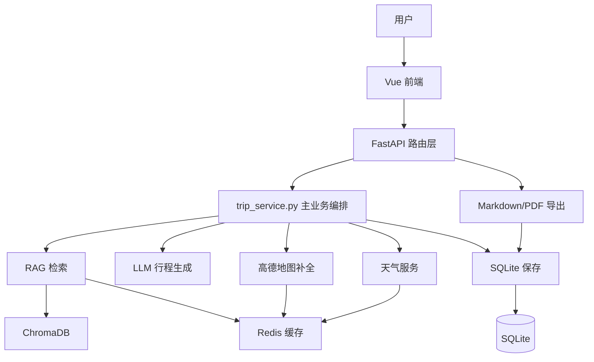

# 智旅云图项目知识文档

> 本文档基于当前仓库代码整理，用来快速理解项目用了哪些框架、涉及哪些知识点、系统如何设计，以及核心业务链路如何跑通。

## 1. 项目概览

智旅云图是一个 AI 智能旅行规划系统。用户在前端输入目的地、日期、预算、人数、旅行偏好、饮食偏好和额外备注后，后端会结合本地旅行攻略知识库、LLM、地图服务和天气服务，生成结构化旅行行程。

项目不是只返回一段文本，而是把旅行方案组织成可展示、可编辑、可保存、可导出的产品原型，核心能力包括：

- 生成多日旅行 itinerary。
- 根据本地攻略 RAG 补充目的地上下文。
- 调用大模型生成结构化行程草稿。
- 通过高德地图补充景点地址、经纬度、POI、路线距离和图片。
- 查询天气预报并在前端展示。
- 支持自然语言编辑某一天行程。
- 支持保存历史行程、查看历史、删除历史。
- 支持导出 Markdown 和中文 PDF。
- 支持 Redis 可选缓存和 SQLite 持久化。

## 2. 技术栈

| 层级 | 使用技术 | 在项目中的作用 |
| --- | --- | --- |
| 前端框架 | Vue 3 | 构建规划页、结果页、历史页 |
| 前端语言 | TypeScript | 定义接口数据类型，减少前后端字段使用错误 |
| 构建工具 | Vite | 前端开发服务器和生产构建 |
| UI 组件库 | Ant Design Vue | 表单、输入框、选择器、消息提示等基础组件 |
| HTTP 客户端 | axios | 前端请求后端接口 |
| 地图前端 | 高德地图 JavaScript API | 在结果页展示景点标记、图片气泡和路线折线 |
| 后端框架 | FastAPI | 提供 REST API |
| 数据校验 | Pydantic v2 | 定义请求体、响应体和 itinerary 结构 |
| ORM | SQLAlchemy | 操作 SQLite 数据库 |
| 业务数据库 | SQLite | 保存用户生成后的完整 itinerary |
| 大模型调用 | LangChain + OpenAI-compatible API | 通过 `ChatOpenAI` 调用 DashScope 兼容接口 |
| 生成模型 | qwen-max 等 | 生成行程草稿、改写检索 query、编辑单日行程 |
| 向量数据库 | ChromaDB | 存储本地攻略片段向量并做相似度召回 |
| Embedding | text-embedding-v4 等 | 把攻略片段和用户 query 转成向量 |
| Rerank | qwen3-rerank | 对向量召回结果做语义重排序 |
| 缓存 | Redis | 缓存天气、地图、RAG、Rerank 结果 |
| 外部 API | 高德地图 Web API | 地址解析、POI 搜索、路线估算、天气查询 |
| PDF 生成 | ReportLab | 生成中文 PDF 行程单 |
| 测试 | pytest | 后端服务、模型、RAG、API 测试 |

## 3. 项目目录结构

```text
yuntu-ai/
├─ backend/
│  ├─ app/
│  │  ├─ api/
│  │  │  ├─ main.py                 # FastAPI 应用入口
│  │  │  └─ routes/                 # trip/export/weather 路由
│  │  ├─ agents/
│  │  │  ├─ trip_planner_agent.py   # LLM 行程生成和单日编辑
│  │  │  └─ tools/rag_tool.py       # Query Rewrite + RAG 调用入口
│  │  ├─ models/
│  │  │  ├─ schemas.py              # Pydantic 请求/响应/业务模型
│  │  │  └─ db_models.py            # SQLAlchemy ORM 表模型
│  │  ├─ rag/
│  │  │  ├─ retriever.py            # 检索、缓存、Rerank
│  │  │  └─ vector_db.py            # 当前主链路使用的 Chroma 入库/检索
│  │  ├─ services/
│  │  │  ├─ trip_service.py         # 行程生成主编排
│  │  │  ├─ map_service.py          # 高德地图服务封装
│  │  │  ├─ weather_service.py      # 高德天气服务封装
│  │  │  ├─ storage_service.py      # SQLite 保存、查询、删除
│  │  │  ├─ export_service.py       # Markdown/PDF 导出
│  │  │  └─ cache_service.py        # Redis JSON 缓存封装
│  │  └─ config.py                  # 环境变量、数据库、全局配置
│  ├─ data/                         # 本地 Markdown 旅行攻略知识库
│  ├─ scripts/                      # 入库、调试、真实接口测试脚本
│  ├─ tests/                        # pytest 测试
│  └─ requirements.txt
├─ frontend/
│  ├─ src/
│  │  ├─ App.vue                    # 页面状态切换入口
│  │  ├─ views/
│  │  │  ├─ Home.vue                # 规划表单页
│  │  │  ├─ Result.vue              # 结果展示、编辑、保存、导出页
│  │  │  └─ History.vue             # 历史行程页
│  │  ├─ components/AmapTripMap.vue # 高德地图展示组件
│  │  ├─ services/api.ts            # axios API 封装
│  │  └─ types/index.ts             # 前端 TypeScript 类型
│  └─ package.json
├─ README.md
├─ 学习文档.md
└─ 项目知识文档.md
```

说明：当前主链路使用 `trip_service.py`、`trip_planner_agent.py` 和 `vector_db.py`。旧后缀版本已经移除。

## 4. 总体架构设计

项目采用前后端分离架构。

前端负责用户交互、表单收集、结果展示、地图渲染、天气展示、保存和导出按钮操作。后端负责业务编排、LLM 调用、RAG 检索、地图天气接口调用、缓存、持久化和导出文件生成。



### 后端分层

| 分层 | 代码位置 | 职责 |
| --- | --- | --- |
| 应用入口层 | `backend/app/api/main.py` | 创建 FastAPI 应用、配置 CORS、注册路由 |
| 路由层 | `backend/app/api/routes/` | 定义 HTTP 接口，不写复杂业务 |
| 服务层 | `backend/app/services/` | 业务编排、缓存、地图、天气、导出、存储 |
| Agent 层 | `backend/app/agents/` | Prompt 构造、LLM 调用、JSON 解析和模型兜底 |
| RAG 层 | `backend/app/rag/` | 文档切片、向量库、召回、Rerank、缓存 |
| 数据模型层 | `backend/app/models/` | Pydantic 模型和 SQLAlchemy ORM |
| 配置层 | `backend/app/config.py` | 环境变量、SQLite、Chroma、Redis、高德、LLM 配置 |

### 前端分层

| 分层 | 代码位置 | 职责 |
| --- | --- | --- |
| 应用入口 | `frontend/src/main.ts` | 创建 Vue 应用并注册 Ant Design Vue |
| 页面切换 | `frontend/src/App.vue` | 用 `currentView` 控制规划页、结果页、历史页 |
| 页面组件 | `frontend/src/views/` | 表单输入、结果展示、历史管理 |
| 业务组件 | `frontend/src/components/AmapTripMap.vue` | 地图点位和线路展示 |
| API 封装 | `frontend/src/services/api.ts` | 统一后端请求地址和函数 |
| 类型定义 | `frontend/src/types/index.ts` | 与后端 Pydantic 模型对应的前端类型 |

这个前端没有使用 Vue Router，而是用 `App.vue` 中的响应式状态手动切换页面。这样实现简单，适合 Demo 和课程项目。

## 5. 核心业务流程

### 5.1 生成旅行行程

用户点击“开始规划”后，调用 `POST /trip/generate`。

```text
Home.vue
  -> generateTrip()
  -> POST /trip/generate
  -> routes/trip.py
  -> trip_service.generate_trip_itinerary()
      1. 计算旅行天数
      2. collect_trip_context() 获取 RAG 上下文
      3. generate_planner_draft() 调用 LLM 生成行程草稿
      4. 服务层补全每日景点、餐饮、住宿、交通
      5. 按预算、节奏、住宿偏好计算花费
      6. 可选调用高德地图补充地址、经纬度、路线
      7. 统计 Query Rewrite、Embedding、Rerank、Planner token
      8. 返回完整 Itinerary
  -> Result.vue 展示结果
```

这个设计的重点是“显式编排”。LLM 不直接掌控所有业务，而是只负责生成草稿；预算计算、地图补全、结构校验、异常兜底由确定性的 Python 代码完成。

### 5.2 智能编辑行程

用户在结果页输入编辑指令后，调用 `POST /trip/edit`。

```text
Result.vue
  -> editTrip()
  -> POST /trip/edit
  -> trip_service.edit_trip_itinerary()
      1. 根据 edit_scope 定位目标 DayPlan
      2. generate_day_edit_draft() 调用 LLM 生成单日编辑草稿
      3. 替换目标日主题、景点、餐饮、备注
      4. 清空旧坐标字段并重新地图补全
      5. 重新计算预算
      6. 返回更新后的 Itinerary
```

如果 LLM 不可用，后端会用规则级逻辑兜底，例如识别“轻松”“不要安排”等关键词。

### 5.3 保存和历史管理

保存行程调用 `POST /trip/save`，后端把完整 itinerary 序列化成 JSON 字符串，保存到 SQLite 的 `trip_records` 表。

`TripRecord` 表的关键字段：

| 字段 | 作用 |
| --- | --- |
| `trip_id` | 业务行程 ID |
| `destination` | 目的地 |
| `summary` | 行程摘要 |
| `itinerary_json` | 完整 itinerary JSON |
| `created_at` | 创建时间 |
| `updated_at` | 更新时间 |

这种设计属于“宽表 + JSON 存储”。优点是开发简单，适合保存完整结构化对象；缺点是后续如果要按景点、城市、预算区间做复杂查询，需要拆成更细的数据表。

### 5.4 导出 Markdown 和 PDF

导出接口位于 `backend/app/api/routes/export.py`。

```text
GET /export/{trip_id}/markdown
  -> 从 SQLite 读取 itinerary
  -> export_service.itinerary_to_markdown()
  -> 返回 text/markdown

GET /export/{trip_id}/pdf
  -> 从 SQLite 读取 itinerary
  -> export_service.itinerary_to_pdf_bytes()
  -> ReportLab 生成 PDF bytes
  -> 返回 application/pdf
```

前端导出前会先调用保存接口，把当前页面上已经过滤过的提示同步到后端，再打开导出地址。

## 6. RAG 设计

RAG 的全称是 Retrieval-Augmented Generation，中文通常叫“检索增强生成”。它的作用是：先从外部知识库检索相关材料，再把这些材料作为上下文交给大模型生成结果。

本项目的 RAG 知识库来自 `backend/data/` 下的 Markdown 攻略文件，例如大理、成都、西安、厦门、三亚攻略。

### 6.1 离线入库流程

脚本：`backend/scripts/ingest_data.py`

```text
本地 Markdown 攻略
  -> vector_db.load_guide_chunks()
  -> 按二级/三级标题切分片段
  -> 调用 embedding 模型生成向量
  -> 写入 ChromaDB
```

关键知识点：

- Markdown 标题切片：把攻略按主题拆成较小片段。
- Embedding：把文本转成向量。
- ChromaDB：保存向量和原文 metadata。
- 稳定 ID：使用 source、title、text 生成 md5，避免重复写入时 ID 混乱。

### 6.2 在线检索流程

```text
用户目的地、偏好、备注
  -> rag_tool.build_destination_query()
      优先 LLM Query Rewrite
      失败后规则级 Query Rewrite
  -> retriever.retrieve_travel_guide()
      查 Redis RAG 缓存
      ChromaDB 向量召回 top-k 候选
      qwen3-rerank 语义重排序
      失败后规则级重排序
      写入 Redis 缓存
  -> 返回攻略片段给 trip_planner_agent.py
  -> 与用户请求一起组装 Prompt
```

### 6.3 Query Rewrite

用户输入往往是自然语言，不一定适合直接检索。例如：

```text
用户输入：大理，不想太早起床，希望安排一个适合看日落的地点
检索 query：大理 日落 傍晚 洱海 双廊 轻松 慢节奏
```

项目里有两套实现：

- LLM Rewrite：用 qwen-max 把用户需求改写成检索关键词。
- 规则 Rewrite：当 LLM 不可用时，根据“日落、拍照、美食、古镇、骑行”等关键词拼接 query。

### 6.4 Rerank

向量召回速度快，但有时会召回泛化片段。项目使用 qwen3-rerank 做 Cross-encoder 语义重排序，把更具体、更贴近用户需求的攻略片段排到前面。

如果 qwen3-rerank 不可用，`retriever.py` 会回退到规则打分：标题命中加分，正文命中加分，文档开头、泛化简介等降权。

## 7. LLM 设计

LLM 相关逻辑主要在 `backend/app/agents/trip_planner_agent.py`。

### 7.1 生成行程草稿

`generate_planner_draft()` 使用 LangChain 的 `ChatOpenAI`，通过 OpenAI-compatible 接口连接 DashScope。

Prompt 要求模型只输出 JSON 对象，并包含：

- `summary`：整体概述。
- `tips`：旅行提示。
- `days`：每天的主题、景点、餐饮和备注。

后端不会直接相信模型输出，而是做了几层处理：

- 从模型返回文本中提取 JSON。
- 兼容模型偶尔返回旧字段，例如单个 `spot_name`。
- 用 Pydantic `PlannerDraft` 校验结构。
- 校验天数是否匹配。
- 失败时返回 `None`，服务层走规则兜底。

### 7.2 单日编辑

`generate_day_edit_draft()` 用完整 itinerary、目标 day 和用户编辑指令生成单日编辑结果。模型只负责给出目标那一天的核心字段，最终合并由 `trip_service.py` 完成。

### 7.3 Token 统计

项目统计四类 token：

- Query Rewrite token。
- Query Embedding token。
- Rerank token。
- Planner token。

这些字段封装在后端 `TokenUsage` 模型里，生成行程时打印到后端日志，并通过 `/trip/stats` 汇总已保存行程的 token 消耗。

## 8. 地图和天气设计

地图和天气都基于高德 API。

### 8.1 后端高德 Web API

`backend/app/services/map_service.py` 封装了：

- `geocode_address()`：地址解析为经纬度。
- `search_places()`：按关键词搜索 POI。
- `estimate_route()`：估算两点之间驾车距离和耗时。
- `enrich_itinerary_with_map_data()`：批量补全 itinerary 中景点、酒店、交通字段。

`backend/app/services/weather_service.py` 封装天气查询：

- 先用地理编码拿城市 adcode。
- 再调用 `/weather/weatherInfo` 查询未来天气。
- 返回城市、发布时间和每日天气字段。

### 8.2 前端高德 JavaScript API

`frontend/src/components/AmapTripMap.vue` 动态加载高德 JS SDK，拿 `VITE_AMAP_JS_KEY` 初始化地图。

地图展示能力包括：

- 过滤出有经纬度的景点。
- 按 dayIndex 排序。
- 用自定义 marker 显示第几天。
- 用图片气泡展示景点图片。
- 多点之间用虚线 Polyline 连接。
- 自动缩放到所有点位可见。

### 8.3 天气感知提示

`Result.vue` 会读取天气结果，如果发现“雨、阵雨、雷阵雨、小雨、中雨、大雨”等关键词，就会：

- 过滤掉不合适的防晒类提示。
- 增加带伞、雨衣、防滑鞋等提示。

## 9. 缓存和持久化设计

项目把“短期可复用结果”和“长期业务数据”分开处理。

### Redis 缓存

实现位置：`backend/app/services/cache_service.py`

缓存内容：

- 天气查询结果。
- 高德地图地理编码、POI、路线结果。
- RAG 检索结果。
- Rerank 排序结果。

特点：

- Redis 开关由 `REDIS_ENABLED` 控制。
- key 统一加 `REDIS_KEY_PREFIX` 前缀。
- 缓存值统一 JSON 序列化。
- Redis 不可用时自动跳过，不影响主流程。

### SQLite 持久化

实现位置：

- `backend/app/models/db_models.py`
- `backend/app/services/storage_service.py`

保存内容：

- 用户主动保存的完整 itinerary。
- 行程摘要、目的地、创建时间、更新时间。
- token 统计也随 itinerary JSON 一起保存。

简言之：Redis 用来提速，SQLite 用来存业务数据。

## 10. API 接口清单

| 方法 | 路径 | 说明 | 前端调用位置 |
| --- | --- | --- | --- |
| GET | `/` | 后端启动检查 | 浏览器或健康检查 |
| GET | `/health` | 健康检查 | 浏览器或本地检查 |
| POST | `/trip/generate` | 同步生成行程（兼容/调试） | 调试调用 |
| POST | `/trip/generate/jobs` | 创建后台生成任务 | `Home.vue` |
| GET | `/trip/generate/jobs/{job_id}` | 查询生成进度 | `api.ts` |
| DELETE | `/trip/generate/jobs/{job_id}` | 取消生成任务 | `api.ts` |
| POST | `/trip/edit` | 智能编辑行程 | `Result.vue` |
| POST | `/trip/save` | 保存行程 | `Result.vue` |
| GET | `/trip` | 获取历史列表 | `History.vue` |
| GET | `/trip/{trip_id}` | 获取行程详情 | `History.vue` |
| DELETE | `/trip/{trip_id}` | 删除行程 | `History.vue` |
| GET | `/trip/stats` | 获取 token 消耗统计 | 后端统计接口 |
| GET | `/weather/forecast` | 查询天气预报 | `Result.vue` |
| GET | `/export/{trip_id}/markdown` | 导出 Markdown | `Result.vue` |
| GET | `/export/{trip_id}/pdf` | 导出 PDF | `Result.vue` |

## 11. 前端页面设计

### Home.vue

负责收集用户旅行需求：

- 目的地。
- 开始日期和结束日期。
- 人数。
- 预算。
- 酒店档次。
- 旅行节奏。
- 旅行偏好。
- 饮食偏好。
- 额外要求。

提交后调用 `generateTrip()`，成功后把 itinerary 通过事件传给 `App.vue`。

### App.vue

负责三个页面之间的数据中转：

- `currentView = "home"` 展示规划页。
- `currentView = "result"` 展示结果页。
- `currentView = "history"` 展示历史页。

`latestItinerary` 保存当前最新行程，供结果页展示。

### Result.vue

项目中最复杂的前端页面，负责：

- 行程概览。
- 预算明细。
- 按天花费。
- 地图展示。
- 天气展示。
- 旅行提示过滤。
- 智能调整行程。
- 保存行程。
- 导出 PDF 和 Markdown。
- 展示每日行程详情。

### History.vue

负责历史行程管理：

- 进入页面时加载历史列表。
- 查看某条行程详情。
- 删除行程。
- 打开历史行程后传回 `App.vue` 并切换到结果页。

## 12. 项目涉及的主要知识点

### 后端知识点

- FastAPI 路由设计。
- Pydantic 数据建模和校验。
- SQLAlchemy ORM。
- SQLite 文件型数据库。
- RESTful API 设计。
- CORS 跨域配置。
- 环境变量和 `.env` 配置管理。
- httpx 调用外部 HTTP API。
- 异常兜底和降级设计。
- ReportLab 中文 PDF 生成。

### 前端知识点

- Vue 3 Composition API。
- TypeScript 接口建模。
- 组件通信：props 和 emits。
- computed、watch、ref、reactive。
- axios 封装 API。
- Ant Design Vue 表单和提示组件。
- 动态加载第三方 JS SDK。
- 地图 marker、infoWindow、polyline 渲染。
- 页面状态切换。

### AI 应用知识点

- Prompt 设计。
- OpenAI-compatible 大模型接口。
- LangChain `ChatOpenAI` 使用。
- LLM JSON 输出约束。
- JSON 提取和 Pydantic 校验。
- LLM 失败兜底。
- Query Rewrite。
- RAG 检索增强生成。
- Embedding 向量化。
- ChromaDB 向量检索。
- Cross-encoder Rerank。
- Token 统计和成本观测。

### 工程化知识点

- 前后端分离。
- 服务层分层设计。
- Redis 缓存封装。
- 后台任务状态、进度轮询和协作式取消。
- 行程来源可信度与外部地图核验状态。
- pytest 单元测试和接口测试。

## 13. 当前设计优点

1. 分层清晰  
   路由层只接 HTTP 请求，复杂逻辑放在 service、agent、rag 层，后续扩展比较方便。

2. LLM 使用相对稳健  
   模型只生成结构化草稿，最终业务结构由服务层整理，并且有 JSON 提取、Pydantic 校验和规则兜底。

3. RAG 链路完整  
   包含本地知识库、Embedding、ChromaDB、Query Rewrite、Rerank、缓存和降级检索。

4. 外部服务封装独立  
   高德地图、天气、缓存、导出、存储都各自封装成 service，职责比较单一。

5. 产品闭环完整  
   从生成、展示、编辑、保存、历史、导出到部署都有基本实现。

## 14. 当前设计限制

1. SQLite 表结构较简单  
   完整 itinerary 存为 JSON 字符串，适合 Demo，但不利于复杂查询和统计。

2. 前端没有路由  
   当前用状态切换页面，简单可用；如果页面增多，可以引入 Vue Router。

3. 前后端类型不是自动同步  
   后端 Pydantic 和前端 TypeScript 是手动维护，字段变化时需要两边同步。

4. RAG 主链路存在版本文件  
   当前检索与数据导入统一使用 `vector_db.py`，新增向量库逻辑时应继续复用这一入口。

5. 外部 API 依赖较多  
   LLM、高德、Redis、Chroma 都可能影响完整链路，需要保留降级逻辑和错误提示。

## 15. 如何运行和验证

### 后端本地运行

```bash
cd backend
pip install -r requirements.txt
uvicorn app.api.main:app --reload --host 0.0.0.0 --port 8000
```

### 前端本地运行

```bash
cd frontend
npm install
npm run dev
```

访问：

```text
http://127.0.0.1:5173
```

### 初始化 RAG 知识库

```powershell
cd backend
.\venv\Scripts\python.exe -m app.reingest
```

### 后端测试

```bash
cd backend
pytest -q
```

## 16. 推荐学习路线

如果要从零理解这个项目，可以按下面顺序读代码：

1. 先看 `frontend/src/views/Home.vue` 和 `frontend/src/services/api.ts`，理解前端如何提交旅行需求。
2. 再看 `backend/app/api/routes/trip.py`，理解接口如何进入后端。
3. 重点看 `backend/app/services/trip_service.py`，这是行程生成主流程。
4. 看 `backend/app/models/schemas.py`，理解完整 itinerary 数据结构。
5. 看 `backend/app/agents/trip_planner_agent.py`，理解 LLM Prompt 和 JSON 校验。
6. 看 `backend/app/agents/tools/rag_tool.py`、`backend/app/rag/retriever.py`、`backend/app/rag/vector_db.py`，理解 RAG。
7. 看 `backend/app/services/map_service.py` 和 `weather_service.py`，理解外部 API 封装。
8. 看 `frontend/src/views/Result.vue` 和 `frontend/src/components/AmapTripMap.vue`，理解结果页如何展示地图、天气、预算、编辑和导出。
9. 看 `backend/app/services/storage_service.py` 和 `export_service.py`，理解保存和导出。
10. 最后看 `backend/tests/conftest.py`、`observability.py` 和任务服务，理解测试隔离与运行观测。

## 17. 答辩或讲解时可以这样概括

这个项目是一个前后端分离的 AI 旅行规划系统。前端使用 Vue 3、TypeScript、Vite 和 Ant Design Vue 构建交互页面；后端使用 FastAPI、Pydantic、SQLAlchemy 和 SQLite 提供业务接口和数据持久化。AI 能力上，项目使用 LangChain 接入 DashScope 的大模型，通过 RAG 从本地 Markdown 攻略中检索相关上下文，再让模型生成结构化 itinerary。RAG 链路包含 Query Rewrite、Embedding、ChromaDB 向量召回、qwen3-rerank 重排序和 Redis 缓存。生成后的行程会通过高德地图 Web API 补充地址、坐标、POI、路线和天气，前端再用高德 JS API 做地图可视化。整体设计采用显式服务编排，让 LLM 负责生成草稿，让后端代码负责校验、兜底、预算计算和外部服务补全，因此比单纯的文本生成 Demo 更接近完整产品链路。
